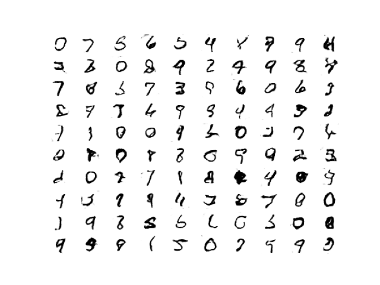
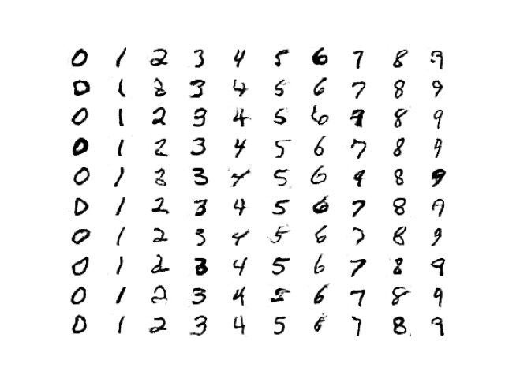

# Keras Neural Networks
This repository is a collection of some of some of the most common types of neural networks implemented using the Keras library.
The models/datasets used in this project are:

- A regression model on the [Boston Housing price regression dataset](https://keras.io/api/datasets/boston_housing/)
- A CNN model on the [CIFAR10 small images classification dataset](https://keras.io/api/datasets/cifar10/)
- Sentiment classification of the [IMDB movie review sentiment classification dataset](https://keras.io/api/datasets/imdb/)
- A GAN on the [MNIST digits classification dataset](https://keras.io/api/datasets/mnist/)
- A conditional GAN on the [MNIST digits classification dataset](https://keras.io/api/datasets/mnist/)

## Boston Housing Price Regression
This dataset is composed of 13 attributes of houses at different locations around the Boston suburbs in the late 1970s. Targets are the median values of the houses at a location (in k$). The model is a fully connected neural network and achieves a mean absolute error of ~2.75.

## CIFAR10 Small Images Classification
This dataset is composed of 50,000 32x32 color training images and 10,000 test images, labeled over 10 categories. The classes are airplane, automobile, bird, cat, deer, dog, frog, horse, ship, and truck. The model is a standard convolutional neural network with alternating convolutional and max-pooling layers and achieves an accuracy of ~67%.

## IMDB Movie Review Sentiment Classification
This dataset consists of 25,000 movies reviews from IMDB, labeled by sentiment (positive/negative). Reviews have been preprocessed, and each review is encoded as a list of word indexes (integers). For convenience, words are indexed by overall frequency in the dataset, so that for instance the integer "3" encodes the 3rd most frequent word in the data. The model uses an embedding layer to create an embedding for each of the words which then passes those embeddings to a fully connected neural network and achieves an accuracy of ~86%.

## MNIST Digits GAN
This dataset consists of 60,000 28x28 grayscale images of the 10 digits, along with a test set of 10,000 images. This dataset was used to train a generative adversarial network that can generate samples that resemble the handwritten digits in the dataset. The model consists of a generator and a discriminator with the generator learning to produce more realistic samples and the discriminator learning to more accurately distinguish which samples are "real" and which have been generated. The following are some examples of digits that the generator learned to produce after 100 epochs of training:

Inspiration was taken from [this](https://machinelearningmastery.com/how-to-develop-a-conditional-generative-adversarial-network-from-scratch/) machinelearningmastery.com GAN tutorial.
Hyperparameters were chosen by using the [GAN hacks](https://machinelearningmastery.com/how-to-code-generative-adversarial-network-hacks/) best practices.

## MNIST Digits Conditional GAN
This dataset consists of 60,000 28x28 grayscale images of the 10 digits, along with a test set of 10,000 images. This dataset was used to train a conditional generative adversarial network which, similiar to the regular GAN, generates samples that resemble the handwritten digits in the dataset. The difference is that this conditional GAN can be told which digit to generate rather than just generating a random digit. The model is similiar to the conventional GAN but it also accepts a digit (0-9) to be generated as input. The model creates an embedding of the digit that it is meant to generate and then combines that embedding as another channel to the CNN. The following are some examples of specific digits that the generator learned to produce after 100 epochs of training:

Inspiration was again taken from [this](https://machinelearningmastery.com/how-to-develop-a-conditional-generative-adversarial-network-from-scratch/) machinelearningmastery.com GAN tutorial.
Hyperparameters were again chosen by using the [GAN hacks](https://machinelearningmastery.com/how-to-code-generative-adversarial-network-hacks/) best practices.
